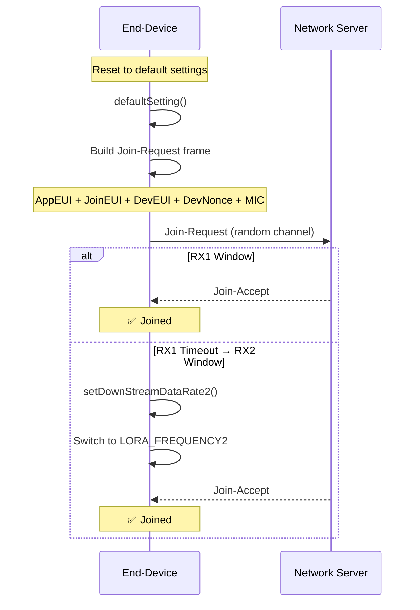
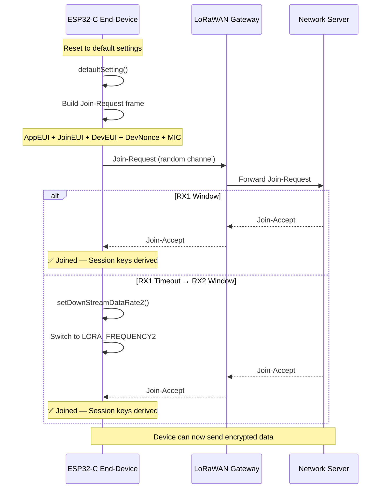

# LoRaWAN-Ready-for-BLE-integration
<p align="center">
  
  
  
  
  
</p>

# 📡 LoRaWAN End-Device Implementation

> A **C/C++ implementation** of the LoRaWAN MAC layer for end-devices — supporting OTAA (Over-the-Air Activation), secure key management, multi-channel communication, and reliable message transmission with automatic retransmission.

---

## 📋 Table of Contents

- [Overview](#-overview)
- [Architecture](#-architecture)
- [Features](#-features)
- [API Reference](#-api-reference)
  - [Configuration Setters](#configuration-setters)
  - [Initialization](#initialization)
  - [Join Procedure (OTAA)](#join-procedure-otaa)
  - [Message Transmission](#message-transmission)
- [Join Flow (OTAA)](#-join-flow-otaa)
- [Security Model](#-security-model)
- [Key Identifiers](#-key-identifiers)

---

## 🔭 Overview

This project implements the **LoRaWAN MAC layer** for end-devices, following the LoRaWAN specification. It handles the complete lifecycle of a LoRaWAN device:

1. **Configuration** — Set device identifiers (DevEUI, JoinEUI) and cryptographic keys
2. **Initialization** — Configure radio parameters (frequency, power, data rate, code rate)
3. **Network Join** — OTAA join procedure via Join-Request / Join-Accept exchange
4. **Data Transmission** — Reliable uplink messaging with automatic channel selection and retransmission

The implementation sits on top of a **LoRaPhy** (physical layer) driver and communicates with a LoRaWAN Network Server.

---

## 🏗 Architecture

```
┌─────────────────────────────────────────────────────────┐
│                    APPLICATION LAYER                     │
│              (User code / Sensor data)                   │
└───────────────────────┬─────────────────────────────────┘
                        │
                        ▼
┌─────────────────────────────────────────────────────────┐
│                  LoRaWAN MAC LAYER                       │
│                  (This Implementation)                   │
│                                                         │
│  ┌──────────┐  ┌──────────┐  ┌───────────────────────┐  │
│  │  Key     │  │  Join    │  │  Message Transmit     │  │
│  │  Mgmt    │  │  (OTAA)  │  │  + Channel Selection  │  │
│  │          │  │          │  │  + Retransmission      │  │
│  └──────────┘  └──────────┘  └───────────────────────┘  │
│                                                         │
│  ┌──────────────────────────────────────────────┐       │
│  │  Security: AES-128 Encryption + MIC (CMAC)   │       │
│  └──────────────────────────────────────────────┘       │
└───────────────────────┬─────────────────────────────────┘
                        │
                        ▼
┌─────────────────────────────────────────────────────────┐
│                  LoRa PHYSICAL LAYER                     │
│           (SX1276/SX1278 radio driver)                   │
│                                                         │
│  Frequency · Spreading Factor · Bandwidth · TX Power     │
└─────────────────────────────────────────────────────────┘
                        │
                        ▼
                   ┌─────────┐
                   │   RF    │
                   │ (Radio) │
                   └─────────┘
```

---

## ✨ Features

| Feature | Description |
|---------|-------------|
| 🔑 **OTAA Activation** | Full Over-the-Air Activation with Join-Request / Join-Accept |
| 🔐 **AES-128 Security** | AppKey, NwkKey, AppSKey, NetSKey, JSIntKey, JSEncKey management |
| 📻 **Multi-Channel** | 16-channel support with Channel Frequency List (CFList) |
| 🔄 **Auto Retransmission** | Automatic retry with fallback frequency and data rate |
| 📊 **Adaptive Data Rate** | Upstream/downstream data rate management with DLSettings |
| 🛡️ **Message Integrity** | MIC (Message Integrity Code) calculation on every frame |
| 🎲 **Random Channel Selection** | Channel randomization for load balancing |
| 🔁 **Replay Protection** | DevNonce counter prevents replay attacks |

---

## 📖 API Reference

### Configuration Setters

These functions configure the device identifiers and cryptographic keys before joining a network.

#### Device Identifiers

| Function | Parameters | Description |
|----------|-----------|-------------|
| `setDevAddr(d0, d1, d2, d3)` | 4 × `uint8_t` | Sets the 4-byte device address (DevAddr) |
| `setNetID(d0, d1, d2)` | 3 × `uint8_t` | Sets the 3-byte Network Server identifier (NetID) |
| `setDevEUI(a0..a7)` | 8 × `uint8_t` | Sets the globally unique end-device ID (IEEE EUI64) |
| `setJoinEUI(a0..a7)` | 8 × `uint8_t` | Sets the Join Server identifier (IEEE EUI64) |

#### Cryptographic Keys

| Function | Parameters | Description |
|----------|-----------|-------------|
| `setappKey(n0..n15)` | 16 × `uint8_t` | Sets the **AppKey** — encrypts join requests/responses |
| `setnwkKey(n0..n15)` | 16 × `uint8_t` | Sets the **NwkKey** — secures device-to-network communication |
| `setNetSKey(n0..n15)` | 16 × `uint8_t` | Sets the **NetSKey** — network session key for MAC commands |
| `setAppSKey(a0..a15)` | 16 × `uint8_t` | Sets the **AppSKey** — application session key for payload encryption |

#### Communication Parameters

| Function | Parameters | Description |
|----------|-----------|-------------|
| `setCFList(a0..a15)` | 16 × `uint8_t` | Sets channel frequencies from the Channel Frequency List |
| `setDownStreamDataRate1()` | — | Computes RX1 data rate from upstream DR and DLSettings |
| `setDownStreamDataRate2()` | — | Extracts RX2 data rate from the lower nibble of DLSettings |

---

### Initialization

```cpp
int16_t init();
```

Initializes the LoRa radio and derives internal security keys:

| Action | Detail |
|--------|--------|
| Sets radio frequency | Default carrier frequency |
| Sets TX power | Transmission power level |
| Sets data rate | Spreading factor + bandwidth |
| Sets code rate | Forward error correction ratio |
| Derives **JSIntKey** | Used to MIC Rejoin-Request type 1 messages and Join-Accept answers |
| Derives **JSEncKey** | Used to encrypt Join-Accept triggered by a Rejoin-Request |

**Returns:** `int16_t` status code (0 = success)

---

### Join Procedure (OTAA)

#### `join_request(uint8_t* const mpduPayload)` → `uint8_t`

Constructs a Join-Request MAC frame:

1. Sets the MHDR MType to **Join-Request**
2. Fills the frame with **AppEUI**, **JoinEUI**, and **DevEUI**
3. Appends the **DevNonce** (monotonically incrementing counter — prevents replay attacks)
4. Calculates and appends the **MIC** (Message Integrity Code)

**Returns:** Length of the constructed MPDU payload.

#### `join()` → `bool`

Executes the full OTAA join sequence:

```
┌─────────────┐                          ┌─────────────┐
│  End-Device │                          │   Network   │
│             │                          │   Server    │
└──────┬──────┘                          └──────┬──────┘
       │                                        │
       │  1. defaultSetting()                   │
       │     (reset channels, DR ranges,        │
       │      frequencies, rxParamSetup)        │
       │                                        │
       │  2. Build Join-Request                 │
       │     [AppEUI | JoinEUI | DevEUI |       │
       │      DevNonce | MIC]                   │
       │                                        │
       │──── TX on random channel (1 of 16) ───▶│
       │                                        │
       │  3. Switch to RX1                      │
       │     setDownStreamDataRate1()           │
       │     Set DL frequency for channel       │
       │                                        │
       │◀──────── Join-Accept (RX1) ────────────│
       │     ✅ return true                     │
       │                                        │
       │  — OR if RX1 timeout —                 │
       │                                        │
       │  4. Switch to RX2                      │
       │     setDownStreamDataRate2()           │
       │     Set LORA_FREQUENCY2                │
       │                                        │
       │◀──────── Join-Accept (RX2) ────────────│
       │     ✅ return true                     │
       │                                        │
```

**Returns:** `true` if the device successfully joined the network.

---

### Message Transmission

```cpp
void send_message(uint8_t* const message, uint8_t len);
```

Sends an uplink data message from the end-device to the server:

| Step | Action |
|------|--------|
| 1 | Select a **random channel** from the 16 available |
| 2 | Verify channel **availability** |
| 3 | Set **transmission frequency** and **data rate** for the selected channel |
| 4 | **Transmit** the message via LoRaPhy |
| 5 | Wait for server response within the **RX delay** window |
| 6 | If no ACK in RX1: adjust to **downstream DR2** and **fallback frequency** |
| 7 | **Retry** transmission up to the maximum retransmission count |

**Parameters:**
- `message` — Pointer to the payload buffer
- `len` — Length of the payload in bytes

---

## 🔄 Join Flow (OTAA)



---

## 🔐 Security Model

The implementation uses **AES-128** based security with multiple key layers:

```
Root Keys (Pre-provisioned)
├── AppKey ──── Used for Join-Request/Accept encryption
└── NwkKey ──── Used for device-to-network security
    ├── JSIntKey ── Derived at init() → MIC for Rejoin-Request type 1
    └── JSEncKey ── Derived at init() → Encrypt Join-Accept on Rejoin

Session Keys (Derived after Join)
├── AppSKey ── Encrypts application payload (end-to-end)
└── NetSKey ── Secures MAC commands (hop-by-hop)
```

| Key | Size | Purpose |
|-----|------|---------|
| **AppKey** | 128-bit | Encrypts join requests and responses |
| **NwkKey** | 128-bit | Secures communication between device and network server |
| **JSIntKey** | 128-bit | MIC calculation for Rejoin-Request type 1 and Join-Accept |
| **JSEncKey** | 128-bit | Encrypts Join-Accept triggered by Rejoin-Request |
| **AppSKey** | 128-bit | Application session key — encrypts application data |
| **NetSKey** | 128-bit | Network session key — secures MAC layer commands |

---

## 🏷 Key Identifiers

| Identifier | Format | Description |
|------------|--------|-------------|
| **DevEUI** | IEEE EUI64 (8 bytes) | Globally unique end-device ID; printed on device labels |
| **JoinEUI** | IEEE EUI64 (8 bytes) | Identifies the Join Server that processes join procedures |
| **AppEUI** | IEEE EUI64 (8 bytes) | Identifies the application entity processing JoinReq frames |
| **DevAddr** | 4 bytes | Short device address assigned by the network |
| **NetID** | 3 bytes | Network Server's unique identifier |
| **DevNonce** | Counter | Starts at 0; incremented per join — prevents replay attacks |
| **CFList** | 16 bytes | Channel Frequency List — configures up/downlink frequencies |

---

## 🛠 Tech Stack

| Component | Technology |
|-----------|------------|
| **Language** | C / C++ (Embedded) |
| **Protocol** | LoRaWAN 1.1 |
| **Physical Layer** | LoRa (via LoRaPhy driver) |
| **Encryption** | AES-128 (CMAC for MIC) |
| **Addressing** | IEEE EUI64 |
| **Channels** | 16 configurable frequencies |


---

<p align="center">
  Built with 📡 for IoT and LPWAN Communication
</p>


<p align="center">
  
  
  
  
  
  
  
</p>

# 📡 IoT Data Collection & Cloud Integration via LoRaWAN

> An end-to-end **IoT system** that scans **BLE (Bluetooth Low Energy) beacons** using an **ESP32 microcontroller**, processes the data, and transmits it to the cloud via the **LoRaWAN protocol** — featuring a fully custom LoRaWAN MAC layer implementation in C/C++ with OTAA activation, AES-128 security, and multi-channel communication.

**Developed during the SSTM LoRa Internship** · SSTM Simply Smart · June–September 2024

---

## 📋 Table of Contents

- [Project Overview](#-project-overview)
- [System Architecture](#-system-architecture)
- [Key Features](#-key-features)
- [Technology Stack](#-technology-stack)
- [Project Phases](#-project-phases)
  - [Phase 1: Research & Setup](#phase-1-research--setup)
  - [Phase 2: BLE Scanning Implementation](#phase-2-ble-scanning-implementation)
  - [Phase 3: LoRa Communication Implementation](#phase-3-lora-communication-implementation)
- [LoRaWAN MAC Layer API](#-lorawan-mac-layer-api)
  - [Configuration Setters](#configuration-setters)
  - [Initialization](#initialization)
  - [Join Procedure (OTAA)](#join-procedure-otaa)
  - [Message Transmission](#message-transmission)
- [Join Flow (OTAA)](#-join-flow-otaa)
- [Security Model](#-security-model)
- [Key Identifiers](#-key-identifiers)
- [About SSTM](#-about-sstm)
- [Skills Gained](#-skills-gained)
- [References](#-references)

---

## 🔭 Project Overview

This project implements a **fully functional IoT data pipeline** that:

1. **Scans BLE beacons** — Detects and reads data from nearby Bluetooth Low Energy beacons using an ESP32-C microcontroller
2. **Parses beacon data** — Extracts and processes relevant information from BLE advertising packets
3. **Transmits over LoRaWAN** — Sends the collected data to the cloud using a custom LoRaWAN MAC layer implementation
4. **Secures communication** — Uses AES-128 encryption, message integrity codes, and OTAA authentication

The system bridges two wireless technologies — **BLE** for short-range sensor data collection and **LoRa** for long-range cloud communication — creating a complete IoT monitoring solution.

### Why BLE + LoRa?

| Technology | Range | Power | Data Rate | Use Case |
|-----------|-------|-------|-----------|----------|
| **BLE** | ~100m | Ultra-low | ~2 Mbps | Scanning nearby beacons/sensors |
| **LoRa** | ~15 km | Very low | ~50 kbps | Transmitting data to the cloud |

Combining both gives the best of both worlds: efficient **local data collection** with **long-range cloud connectivity**.

---

## 🏗 System Architecture

```
 ┌──────────────┐         ┌──────────────┐
 │  BLE Beacon  │  ···    │  BLE Beacon  │       Short Range (~100m)
 │  (Sensor 1)  │  Radio  │  (Sensor N)  │       Bluetooth Low Energy
 └──────┬───────┘         └──────┬───────┘
        │ BLE Advertising         │
        │ Packets                 │
        └──────────┬──────────────┘
                   │
                   ▼
  ┌─────────────────────────────────────────┐
  │           ESP32-C Microcontroller       │
  │                                         │
  │  ┌─────────────────┐  ┌──────────────┐ │
  │  │  BLE Scanner    │  │  Data Parser │ │
  │  │  (Python)       │──│  & Extractor │ │
  │  └─────────────────┘  └──────┬───────┘ │
  │                              │         │
  │  ┌───────────────────────────┴───────┐ │
  │  │     LoRaWAN MAC Layer (C/C++)     │ │
  │  │  Key Mgmt · OTAA Join · TX/RX    │ │
  │  │  AES-128 · MIC · Channel Select  │ │
  │  └──────────────┬────────────────────┘ │
  │                 │                      │
  │  ┌──────────────┴────────────────────┐ │
  │  │    LoRa Physical Layer Driver     │ │
  │  │  Frequency · SF · BW · TX Power   │ │
  │  └──────────────┬────────────────────┘ │
  └─────────────────┼──────────────────────┘
                    │
                    │ LoRa RF (Long Range ~15km)
                    ▼
  ┌─────────────────────────────────────────┐
  │           LoRaWAN Gateway               │
  └──────────────────┬──────────────────────┘
                     │ IP / Backhaul
                     ▼
  ┌─────────────────────────────────────────┐
  │         LoRaWAN Network Server          │
  └──────────────────┬──────────────────────┘
                     │
                     ▼
  ┌─────────────────────────────────────────┐
  │            Cloud / Application          │
  │         (Data Storage & Analytics)      │
  └─────────────────────────────────────────┘
```

---

## ✨ Key Features

| Feature | Description |
|---------|-------------|
| 📶 **BLE Beacon Scanning** | Detect and read data from nearby BLE beacons using ESP32 |
| 🔍 **Data Parsing & Extraction** | Process and extract relevant fields from BLE advertising packets |
| 📡 **LoRaWAN Transmission** | Custom MAC layer implementation for long-range cloud communication |
| 🔑 **OTAA Activation** | Full Over-the-Air Activation with Join-Request / Join-Accept |
| 🔐 **AES-128 Security** | AppKey, NwkKey, AppSKey, NetSKey, JSIntKey, JSEncKey management |
| 📻 **Multi-Channel** | 16-channel support with Channel Frequency List (CFList) |
| 🔄 **Auto Retransmission** | Automatic retry with fallback frequency and data rate |
| 📊 **Adaptive Data Rate** | Upstream/downstream data rate management with DLSettings |
| 🛡️ **Message Integrity** | MIC (Message Integrity Code) calculation on every frame |
| 🎲 **Random Channel Selection** | Channel randomization for load balancing |
| 🔁 **Replay Protection** | DevNonce counter prevents replay attacks |
| 🐍🔗 **Cross-Language Integration** | Python (BLE libraries) ↔ C++ (LoRaWAN) code migration |

---

## 🧰 Technology Stack

| Layer | Technology | Purpose |
|-------|------------|---------|
| **Microcontroller** | ESP32-C | Central processing unit — runs BLE scanning and LoRa TX |
| **BLE Scanning** | Python + ESP32 BLE libraries | Detect and parse beacon advertising data |
| **LoRaWAN MAC** | C / C++ | Custom MAC layer with OTAA, encryption, and channel management |
| **Physical Layer** | LoRa (via LoRaPhy driver) | Long-range radio communication |
| **Encryption** | AES-128 (CMAC for MIC) | Securing all uplink/downlink messages |
| **Protocol** | LoRaWAN v1.0.3 / v1.1 | LPWAN standard for IoT |
| **Addressing** | IEEE EUI64 | Globally unique device and application identifiers |
| **IDE** | Visual Studio Code | Development environment for both Python and C++ |

---

## 📦 Project Phases

### Phase 1: Research & Setup

| Task | Detail |
|------|--------|
| BLE Technology Research | Studied BLE fundamentals — beacon types, advertising packets, practical applications |
| LoRa Technology Research | Explored LoRa core principles and compared with other wireless methods (WiFi, Zigbee, cellular) |
| Hardware Review | Studied ESP32 / ESP-C architecture, capabilities, and programming environments |
| Software Setup | Installed and configured development tools, libraries, and toolchains |
| Hardware Testing | Set up and verified all hardware components |

### Phase 2: BLE Scanning Implementation

| Task | Detail |
|------|--------|
| Beacon Detection | Wrote code to detect nearby BLE beacons using ESP32 |
| Scanning Methods | Explored and compared active vs. passive scanning approaches |
| Data Parsing | Developed code to process and extract relevant fields from BLE signals |
| Data Formats | Documented different beacon data structures (iBeacon, Eddystone, etc.) |
| Testing & Debugging | Validated scanning reliability across different environments |

### Phase 3: LoRa Communication Implementation

| Task | Detail |
|------|--------|
| LoRa Transmission Code | Developed C++ code to transmit data over LoRa from the ESP32 |
| Library Selection | Evaluated and selected appropriate LoRa libraries and protocols |
| BLE + LoRa Integration | Integrated BLE scanning pipeline with LoRa transmission — seamless data flow |
| System Testing | Rigorous end-to-end testing for performance, reliability, and power efficiency |
| Optimization | Tuned transmission speed, power consumption, and data throughput |

---

## 📖 LoRaWAN MAC Layer API

### Configuration Setters

These functions configure the device identifiers and cryptographic keys before joining a network.

#### Device Identifiers

| Function | Parameters | Description |
|----------|-----------|-------------|
| `setDevAddr(d0, d1, d2, d3)` | 4 × `uint8_t` | Sets the 4-byte device address (DevAddr) |
| `setNetID(d0, d1, d2)` | 3 × `uint8_t` | Sets the 3-byte Network Server identifier (NetID) |
| `setDevEUI(a0..a7)` | 8 × `uint8_t` | Sets the globally unique end-device ID (IEEE EUI64) |
| `setJoinEUI(a0..a7)` | 8 × `uint8_t` | Sets the Join Server identifier (IEEE EUI64) |

#### Cryptographic Keys

| Function | Parameters | Description |
|----------|-----------|-------------|
| `setappKey(n0..n15)` | 16 × `uint8_t` | Sets the **AppKey** — encrypts join requests/responses |
| `setnwkKey(n0..n15)` | 16 × `uint8_t` | Sets the **NwkKey** — secures device-to-network communication |
| `setNetSKey(n0..n15)` | 16 × `uint8_t` | Sets the **NetSKey** — network session key for MAC commands |
| `setAppSKey(a0..a15)` | 16 × `uint8_t` | Sets the **AppSKey** — application session key for payload encryption |

#### Communication Parameters

| Function | Parameters | Description |
|----------|-----------|-------------|
| `setCFList(a0..a15)` | 16 × `uint8_t` | Sets channel frequencies from the Channel Frequency List |
| `setDownStreamDataRate1()` | — | Computes RX1 data rate from upstream DR and DLSettings |
| `setDownStreamDataRate2()` | — | Extracts RX2 data rate from the lower nibble of DLSettings |

---

### Initialization

```cpp
int16_t init();
```

Initializes the LoRa radio and derives internal security keys:

| Action | Detail |
|--------|--------|
| Sets radio frequency | Default carrier frequency |
| Sets TX power | Transmission power level |
| Sets data rate | Spreading factor + bandwidth |
| Sets code rate | Forward error correction ratio |
| Derives **JSIntKey** | Used to MIC Rejoin-Request type 1 messages and Join-Accept answers |
| Derives **JSEncKey** | Used to encrypt Join-Accept triggered by a Rejoin-Request |

**Returns:** `int16_t` status code (0 = success)

---

### Join Procedure (OTAA)

#### `join_request(uint8_t* const mpduPayload)` → `uint8_t`

Constructs a Join-Request MAC frame:

1. Sets the MHDR MType to **Join-Request**
2. Fills the frame with **AppEUI**, **JoinEUI**, and **DevEUI**
3. Appends the **DevNonce** (monotonically incrementing counter — prevents replay attacks)
4. Calculates and appends the **MIC** (Message Integrity Code)

**Returns:** Length of the constructed MPDU payload.

#### `join()` → `bool`

Executes the full OTAA join sequence:

```
┌─────────────┐                          ┌─────────────┐
│  End-Device │                          │   Network   │
│  (ESP32-C)  │                          │   Server    │
└──────┬──────┘                          └──────┬──────┘
       │                                        │
       │  1. defaultSetting()                   │
       │     (reset channels, DR ranges,        │
       │      frequencies, rxParamSetup)        │
       │                                        │
       │  2. Build Join-Request                 │
       │     [AppEUI | JoinEUI | DevEUI |       │
       │      DevNonce | MIC]                   │
       │                                        │
       │──── TX on random channel (1 of 16) ───▶│
       │                                        │
       │  3. Switch to RX1                      │
       │     setDownStreamDataRate1()           │
       │     Set DL frequency for channel       │
       │                                        │
       │◀──────── Join-Accept (RX1) ────────────│
       │     ✅ return true                     │
       │                                        │
       │  — OR if RX1 timeout —                 │
       │                                        │
       │  4. Switch to RX2                      │
       │     setDownStreamDataRate2()           │
       │     Set LORA_FREQUENCY2                │
       │                                        │
       │◀──────── Join-Accept (RX2) ────────────│
       │     ✅ return true                     │
       │                                        │
```

**Returns:** `true` if the device successfully joined the network.

---

### Message Transmission

```cpp
void send_message(uint8_t* const message, uint8_t len);
```

Sends an uplink data message from the end-device to the server:

| Step | Action |
|------|--------|
| 1 | Select a **random channel** from the 16 available |
| 2 | Verify channel **availability** |
| 3 | Set **transmission frequency** and **data rate** for the selected channel |
| 4 | **Transmit** the message via LoRaPhy |
| 5 | Wait for server response within the **RX delay** window |
| 6 | If no ACK in RX1: adjust to **downstream DR2** and **fallback frequency** |
| 7 | **Retry** transmission up to the maximum retransmission count |

**Parameters:**
- `message` — Pointer to the payload buffer
- `len` — Length of the payload in bytes

---

## 🔄 Join Flow (OTAA)



---

## 🔐 Security Model

The implementation uses **AES-128** based security with multiple key layers:

```
Root Keys (Pre-provisioned on ESP32)
├── AppKey ──── Used for Join-Request/Accept encryption
└── NwkKey ──── Used for device-to-network security
    ├── JSIntKey ── Derived at init() → MIC for Rejoin-Request type 1
    └── JSEncKey ── Derived at init() → Encrypt Join-Accept on Rejoin

Session Keys (Derived after successful Join)
├── AppSKey ── Encrypts application payload (end-to-end)
└── NetSKey ── Secures MAC commands (hop-by-hop)
```

| Key | Size | Purpose |
|-----|------|---------|
| **AppKey** | 128-bit | Encrypts join requests and responses |
| **NwkKey** | 128-bit | Secures communication between device and network server |
| **JSIntKey** | 128-bit | MIC calculation for Rejoin-Request type 1 and Join-Accept |
| **JSEncKey** | 128-bit | Encrypts Join-Accept triggered by Rejoin-Request |
| **AppSKey** | 128-bit | Application session key — encrypts application data |
| **NetSKey** | 128-bit | Network session key — secures MAC layer commands |

---

## 🏷 Key Identifiers

| Identifier | Format | Description |
|------------|--------|-------------|
| **DevEUI** | IEEE EUI64 (8 bytes) | Globally unique end-device ID; printed on device labels |
| **JoinEUI** | IEEE EUI64 (8 bytes) | Identifies the Join Server that processes join procedures |
| **AppEUI** | IEEE EUI64 (8 bytes) | Identifies the application entity processing JoinReq frames |
| **DevAddr** | 4 bytes | Short device address assigned by the network |
| **NetID** | 3 bytes | Network Server's unique identifier |
| **DevNonce** | Counter | Starts at 0; incremented per join — prevents replay attacks |
| **CFList** | 16 bytes | Channel Frequency List — configures up/downlink frequencies |

---

## 🏢 About SSTM

**SSTM Egypt (Simply Smart)** is an IoT solutions company specializing in industry-grade M2M (Machine-to-Machine) and IoT platforms. With deep expertise across the full technology stack — from GSM and Zigbee to Bluetooth 5.0 and LoRa — SSTM develops custom, scalable solutions for interconnected systems.

| Detail | Info |
|--------|------|
| **Company** | SSTM Simply Smart IoT Solutions |
| **Industry** | Internet of Things (IoT) |
| **Expertise** | R&D, Electronics Design, IT, Product Development |
| **Technologies** | GSM, Zigbee, BLE 5.0, LoRa, Wired Components |
| **Location** | Egypt |

---

## 🎓 Skills Gained

| Skill Area | Details |
|-----------|---------|
| **Network Protocol Implementation** | Built a LoRaWAN MAC layer from specification documents |
| **Embedded C++ Development** | Programmed ESP32 microcontrollers using Visual Studio Code |
| **Python Integration** | BLE scanning libraries in Python linked with C++ LoRa code |
| **Cross-Language Migration** | Bridged Python and C++ components for seamless data flow |
| **Library Development** | Created brand-new Python libraries for BLE beacon handling |
| **Wireless Communication** | Practical experience with BLE advertising and LoRa modulation |
| **Hardware Prototyping** | First-hand experience setting up and debugging ESP32 hardware |
| **System Optimization** | Tuned for performance, reliability, power efficiency, and speed |
| **Debugging & Testing** | Real-world debugging across different environments and configurations |
| **Team Collaboration** | Worked with senior engineers in a project-oriented environment |

### Related Academic Courses

- Network Protocols
- Random Signals & Noise
- Networking Labs
- Modeling & Simulation
- Performance Modeling

---

## 📚 References

- [LoRaWAN® Specification v1.0.3](https://lora-alliance.org/resource-hub/)
- [LoRaWAN® Specification v1.1](https://lora-alliance.org/resource-hub/)
- [What is LoRaWAN — The Things Network](https://www.thethingsnetwork.org/docs/lorawan/what-is-lorawan/)
- [The Definitive C++ Book Guide and List — Stack Overflow](https://stackoverflow.com/questions/388242/the-definitive-c-book-guide-and-list)
- [C++ Programming Language — GeeksforGeeks](https://www.geeksforgeeks.org/c-plus-plus/)
- [IoT Sensors Research Paper (MDPI)](https://www.mdpi.com/1424-8220/21/23/7992)
- [Seeed Studio nRF52 Boards Library](https://wiki.seeedstudio.com/)
- [Getting Started with Seeed Studio XIAO nRF52840](https://wiki.seeedstudio.com/XIAO_BLE/)

---

## 📄 License

This project is open source and available under the [MIT License](LICENSE).

---

<p align="center">
  <b>Ahmed Amir Mansy</b> · Networks Engineering · German University in Cairo<br/>
  Built with 📡 at SSTM Simply Smart · June–September 2024
</p>
